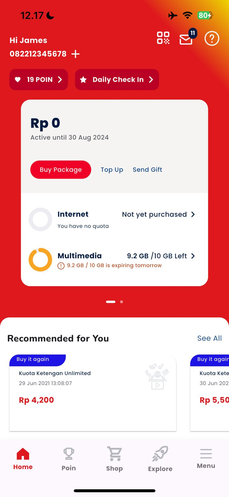

# Telkomsel App

A Flutter-based mobile application replicating the Telkomsel user interface. This project demonstrates modern Flutter development practices with a focus on UI/UX implementation, featuring carousel sliders, custom widgets, and responsive layouts.

## 📱 Features

- **Home Dashboard**: Comprehensive user dashboard with account information and quick actions
- **Package Management**: View and manage internet, multimedia, voice, SMS, and data packages
- **Carousel Cards**: Swipeable information cards with visual indicators
- **Recommendations**: Personalized package recommendations with "Buy it again" feature
- **What's New**: Horizontal scrollable content showcasing new offers and promotions
- **Bottom Navigation**: Easy navigation between Home, Poin, Shop, Explore, and Menu sections

## 🎨 Design Highlights

- Custom gradient backgrounds (red to yellow)
- Circular progress indicators for package usage
- Card-based layouts with shadows and rounded corners
- Responsive horizontal scrolling sections
- Custom icons and branded assets

## 📸 Screenshots



_Home screen showing account balance, package information, and recommendations_

## 🚀 Getting Started

### Prerequisites

Before you begin, ensure you have the following installed:

- [Flutter SDK](https://docs.flutter.dev/get-started/install) (3.9.2 or higher)
- [Dart SDK](https://dart.dev/get-dart) (included with Flutter)
- [Android Studio](https://developer.android.com/studio) or [Xcode](https://developer.apple.com/xcode/) (for iOS development)
- A code editor ([VS Code](https://code.visualstudio.com/) or [Android Studio](https://developer.android.com/studio))

### Installation

1. **Clone the repository**

   ```bash
   git clone https://github.com/Niconi/telkomsel_app.git
   cd telkomsel_app
   ```

2. **Install dependencies**

   ```bash
   flutter pub get
   ```

3. **Verify Flutter setup**

   ```bash
   flutter doctor
   ```

   Make sure all checkmarks are green. If not, follow the suggested fixes.

4. **Run the app**

   For Android:

   ```bash
   flutter run
   ```

   For iOS (macOS only):

   ```bash
   open ios/Runner.xcworkspace
   # Then run from Xcode, or use:
   flutter run -d ios
   ```

   For Web:

   ```bash
   flutter run -d chrome
   ```

### Build for Production

**Android APK:**

```bash
flutter build apk --release
```

**iOS (requires Apple Developer account):**

```bash
flutter build ios --release
```

**Web:**

```bash
flutter build web --release
```

## 📦 Dependencies

This project uses the following packages:

- [`google_fonts`](https://pub.dev/packages/google_fonts) (^6.3.2) - Custom typography with Poppins font
- [`carousel_slider`](https://pub.dev/packages/carousel_slider) - Swipeable card carousel
- [`percent_indicator`](https://pub.dev/packages/percent_indicator) - Circular progress indicators for package usage

To update dependencies:

```bash
flutter pub upgrade
```

## 🗂️ Project Structure

```
lib/
├── main.dart                          # App entry point
├── themes.dart                        # Color schemes, text styles
└── screens/
    ├── bottom_nav_bar.dart           # Bottom navigation bar
    └── home/
        ├── home.dart                  # Home screen
        └── components/
            ├── card_info_home_1.dart # First info card (Internet/Multimedia)
            ├── card_info_home_2.dart # Second info card (Voice/SMS/Data)
            └── whats_new_card.dart   # What's New section
```

## 🎯 Key Components

### Home Screen (`home.dart`)

The main dashboard featuring:

- Header with user info and quick actions
- Carousel slider with package information cards
- Recommended packages section
- What's New promotional content

### Card Info Components

- **CardInfoHome**: Displays Internet and Multimedia package details with circular progress
- **CardInfoHome2**: Shows Voice, SMS, and Data package status

### What's New Card (`whats_new_card.dart`)

Horizontally scrollable promotional cards showcasing:

- Video Digital Subscription offers
- Undi-undi Hepi (Prize Draw) promotions

## 🎨 Customization

### Colors

Edit `themes.dart` to customize the color scheme:

```dart
Color redColor = Color(0xFFEC2028);
Color yellowColor = Color(0xFDB913);
// ... more colors
```

### Fonts

The app uses Google Fonts (Poppins). To change:

```dart
TextStyle boldText15 = GoogleFonts.poppins(
  fontSize: 15,
  fontWeight: FontWeight.w700,
);
```

### Assets

Place images in:

- `assets/icons/` - Icon assets
- `assets/images/` - Background images and promotional content

Update `pubspec.yaml` if adding new asset directories:

```yaml
flutter:
  assets:
    - assets/images/
    - assets/icons/
```

## 🐛 Troubleshooting

**Hot Reload Not Working:**

- Press `R` in terminal for hot restart (capital R)
- Or enable auto hot reload in VS Code: Settings → Flutter: Hot Reload On Save → "always"

**Asset Loading Errors:**

- Ensure assets are declared in `pubspec.yaml`
- Run `flutter pub get` after updating pubspec
- Verify file paths match exactly (case-sensitive)

**Build Errors:**

- Clean the build: `flutter clean && flutter pub get`
- Check Flutter version: `flutter --version`
- Update dependencies: `flutter pub upgrade --major-versions`

## 🤝 Contributing

Contributions are welcome! Please follow these steps:

1. Fork the repository
2. Create a feature branch (`git checkout -b feature/AmazingFeature`)
3. Commit your changes (`git commit -m 'Add some AmazingFeature'`)
4. Push to the branch (`git push origin feature/AmazingFeature`)
5. Open a Pull Request

## 📄 License

This project is for educational purposes. Telkomsel branding and assets are property of PT Telekomunikasi Selular (Telkomsel).

## 📞 Contact

Project Link: [https://github.com/Niconi/telkomsel_app](https://github.com/Niconi/telkomsel_app)

## 🙏 Acknowledgments

- [Flutter Documentation](https://docs.flutter.dev/)
- [Material Design Guidelines](https://material.io/design)
- [Telkomsel](https://www.telkomsel.com/) for design inspiration
